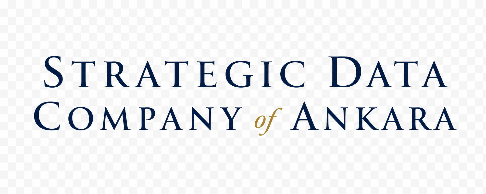

  
  <!-- CODEX: generate the Strategic Data Company of Ankara logo here (logo.png) -->

# 🛰️ Strategic Data Company of Ankara

**Threat-intelligence indices for a contested world.**

An operating company of **[🏰 Monarch Castle Holdings](https://github.com/MonarchCastleHoldings)**.

---

## 🗺️ The indices

| Index | Coverage | Repository |
|---|---|---|
| **BNTI** — Border-Neighbor Threat Index | Türkiye's border neighbors | [border-neighbor-threat-index](https://github.com/SDCofA/border-neighbor-threat-index) |
| **WTI** — World Threat Index | 195 countries · 13 blocs | [world-threat-index](https://github.com/SDCofA/world-threat-index) |
| **MENA** — MENA Threat Index | Middle East & North Africa | [mena-threat-index](https://github.com/SDCofA/mena-threat-index) |

---

## 📐 Method

Evidence-first: every index value is traceable to its **open source** and **collection timestamp**, refreshed automatically by scheduled intelligence pipelines. No un-provenanced numbers — ever.

> Sister company: [⚙️ Monarch Castle Technologies](https://github.com/monarchcastletech)

🛰️ Strategic Data Company of Ankara · a Monarch Castle Holdings company

